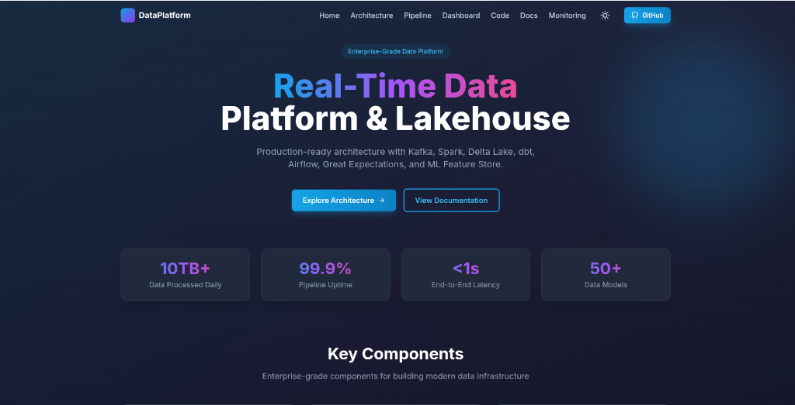
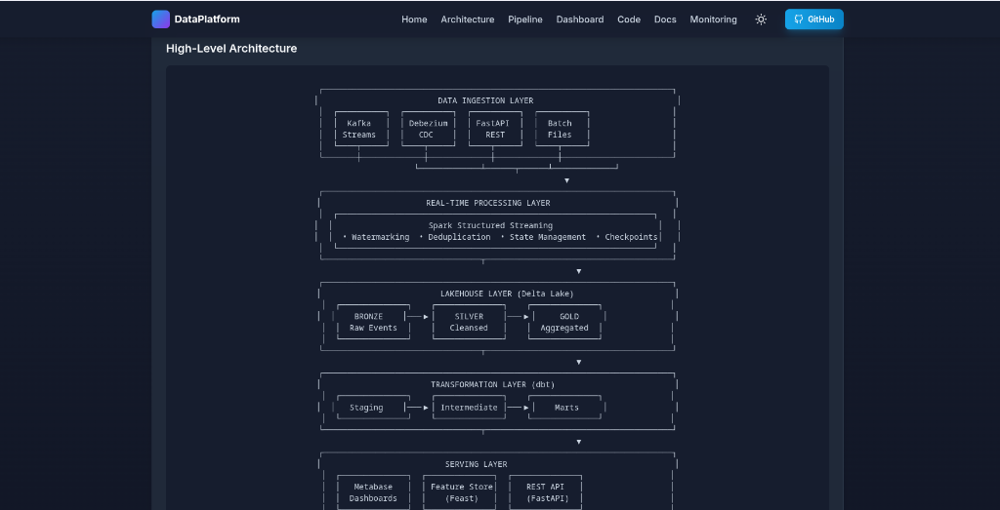
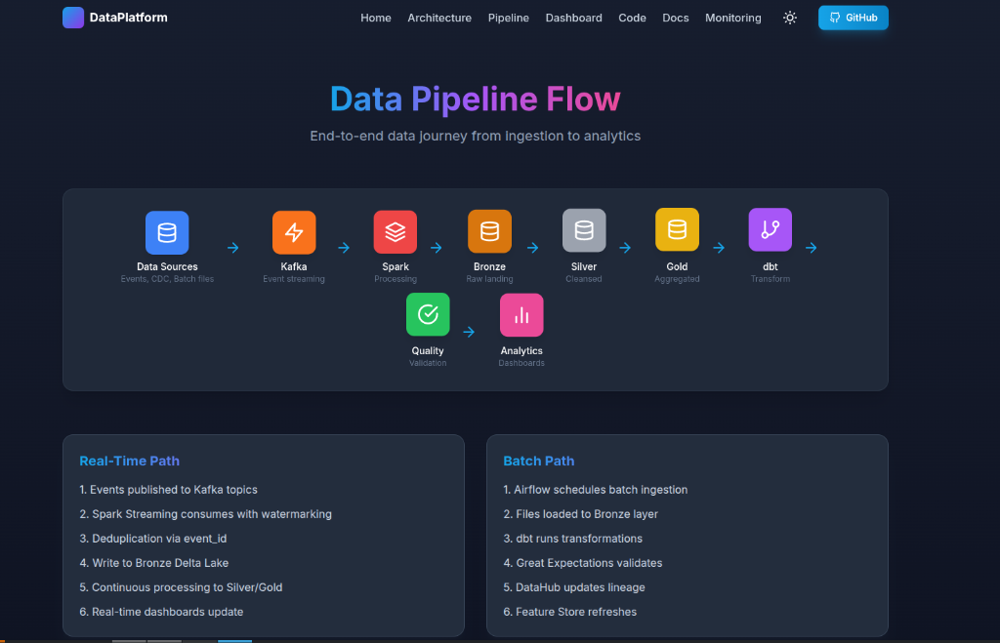
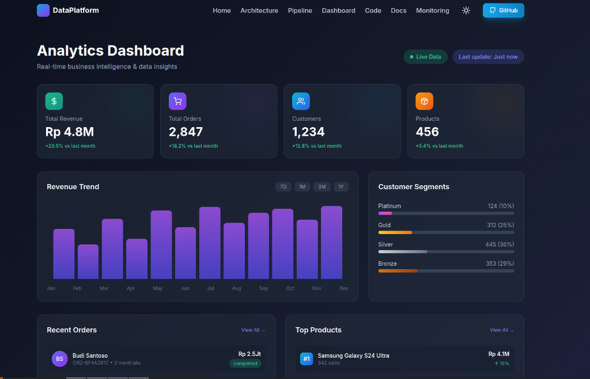
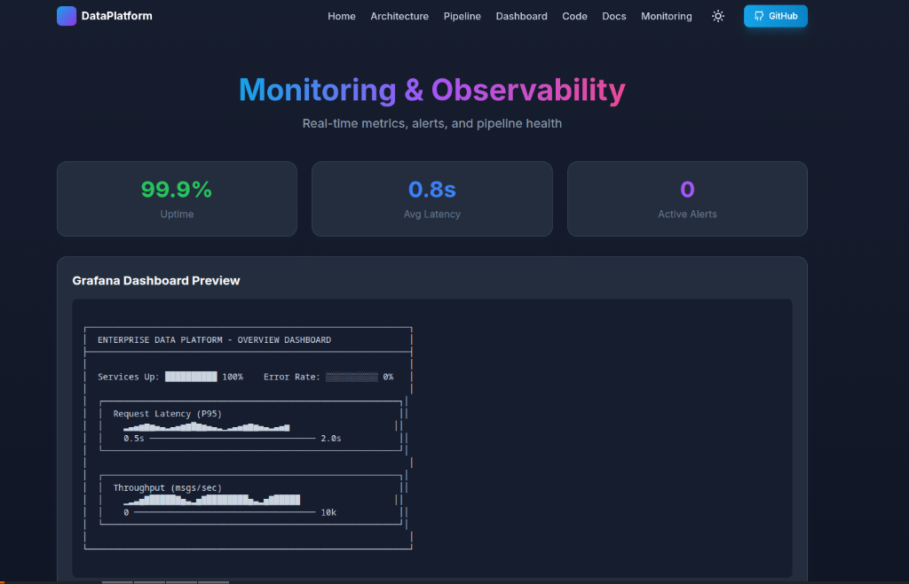

# 🌟 Portfolio Showcase

Berikut adalah tampilan visual dan arsitektur dari Enterprise Data Platform yang telah dibangun.

---

## 🚀 Hero Section
Halaman utama website portfolio yang menampilkan overview capabilities platform.

---

## �️ High-Level Architecture
Desain arsitektur end-to-end mulai dari Data Ingestion, Processing, Lakehouse Storage, hingga Serving Layer.

---

## � Data Pipeline Flow
Visualisasi alur data (Data Journey) dari sumber (Kafka) melalui proses pembersihan di Spark hingga menjadi data siap saji di Gold layer.

---

## 📊 Analytics Dashboard
Business Intelligence dashboard yang menampilkan metrics utama seperti Revenue dan Orders secara real-time.

---

## � Monitoring & Observability
Grafana dashboard untuk memantau kesehatan sistem, uptime services, dan latency pipeline.

---
*Generated by Enterprise Data Platform Team*
